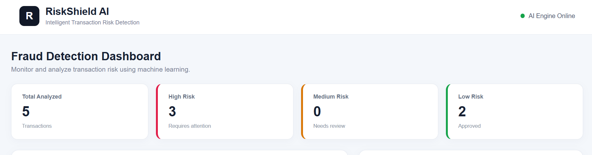
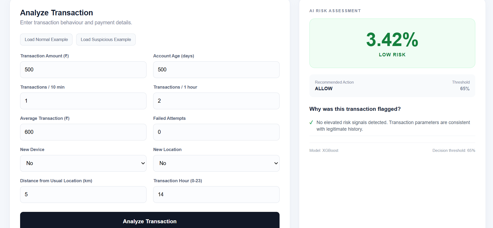
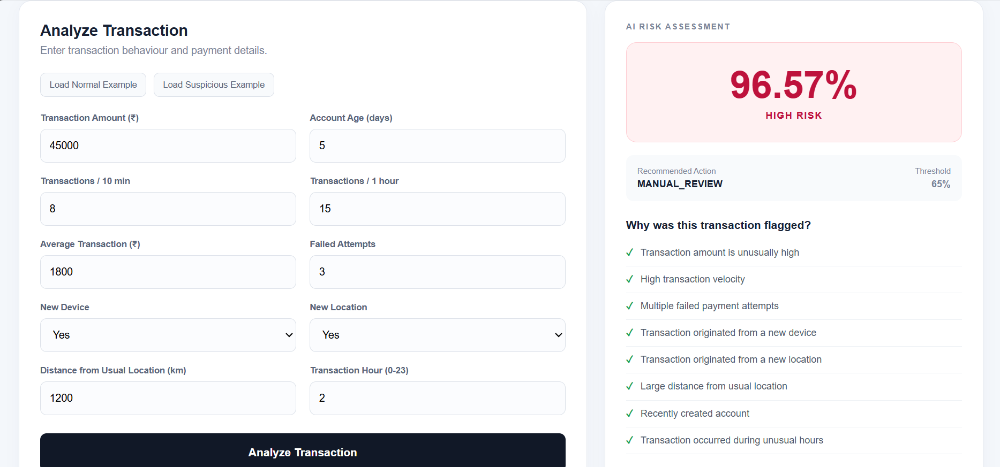
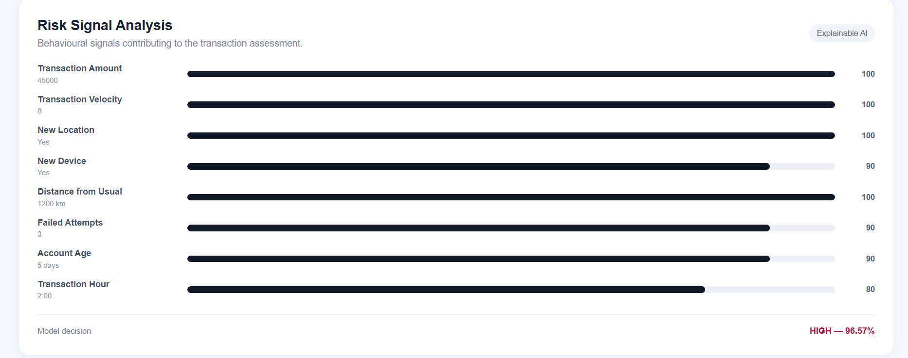
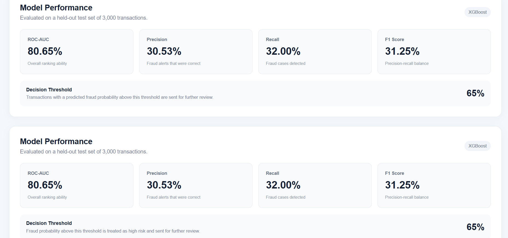
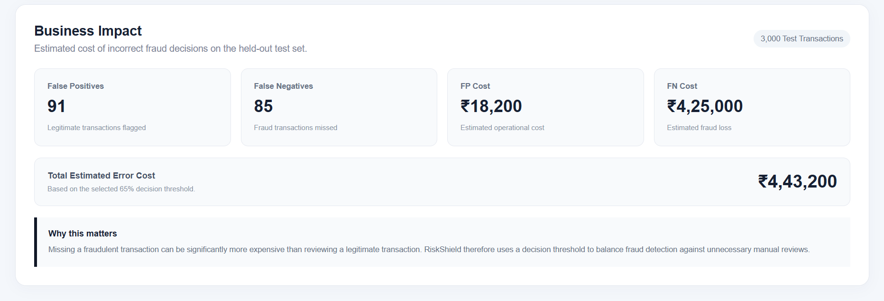
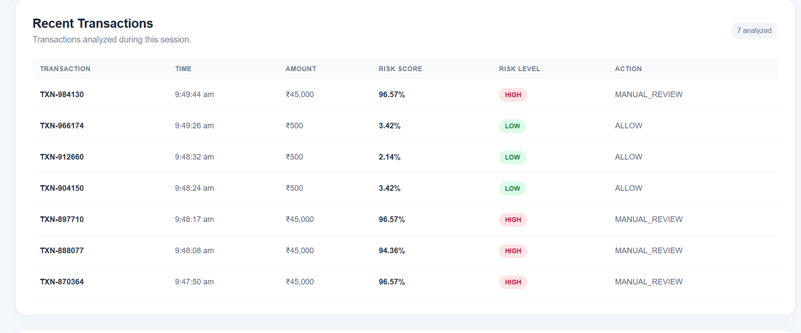

# RiskShield AI

### AI-Powered Transaction Fraud & Risk Manager

RiskShield AI is a machine-learning-based fraud detection prototype that analyzes transaction behaviour and estimates how risky a transaction is.

Instead of simply returning a `fraud` or `not fraud` result, the system gives a risk score, risk level, recommended action, and the suspicious signals that contributed to the assessment.

The project was built to explore how machine learning can be used to support fraud and transaction-risk decisions in payment systems.

---

## What Problem Does It Solve?

Fraud detection is not only about catching fraudulent transactions.

If a system is too strict, it may flag many genuine customers. If it is too relaxed, it may allow fraudulent transactions to pass through.

This creates two important problems:

- **False Positives** – legitimate transactions incorrectly flagged as suspicious.
- **False Negatives** – fraudulent transactions that the system fails to detect.

RiskShield AI tries to balance these two cases by combining an XGBoost fraud classifier with a configurable decision threshold and a separate risk-decision layer.

The goal is not to automatically block a customer's payment, but to provide useful information that can support further review.

---

## How RiskShield AI Works

The application follows a simple pipeline:

```text
Transaction Data
       |
       v
Feature Processing
       |
       v
XGBoost Fraud Model
       |
       v
Fraud Probability
       |
       v
Risk Decision Layer
       |
       +------------------+
       |                  |
       v                  v
   Risk Level       Recommended Action
       |
       v
Risk Signals
       |
       v
React Dashboard
```

The model produces a probability of fraud. The application then uses the configured decision threshold and transaction characteristics to determine the displayed risk level and recommended action.

RiskShield AI is designed as a **defense-oriented risk assessment prototype**. It does not automatically execute irreversible financial actions.

---

# Key Features

### 1. Transaction Analysis

Users can enter transaction and behavioural information such as:

- Transaction amount
- Account age
- Recent transaction frequency
- Average transaction amount
- Failed payment attempts
- New device
- New location
- Distance from usual location
- Transaction hour

---

### 2. AI Risk Assessment

For each transaction, the dashboard displays:

- Risk score
- Risk level
- Recommended action
- Decision threshold
- Model used

Example:

```text
Risk Score:          96.57%
Risk Level:          HIGH
Recommended Action:  MANUAL_REVIEW
Model:               XGBoost
Threshold:           65%
```

---

### 3. Explainable Risk Signals

The application also shows behavioural indicators associated with a suspicious transaction.

Examples include:

- Unusually high transaction amount
- High transaction velocity
- Multiple failed payment attempts
- New device
- New location
- Large distance from usual location
- Recently created account
- Unusual transaction hour

These are presented as **risk signals** to make the result easier to understand.

They should not be interpreted as direct model feature-importance values. A dedicated explainability technique such as SHAP would be required for that.

---

### 4. Transaction History

The frontend keeps a session-level history of transactions analyzed during the current session.

This allows users to quickly compare previously analyzed transactions and their risk results.

---

### 5. Model Performance

The dashboard includes the final evaluation results of the XGBoost model on a held-out test set.

The current results include:

- ROC-AUC
- Precision
- Recall
- F1 Score
- Confusion matrix

---

### 6. Business Impact

The application also provides an illustrative estimate of the cost associated with false positives and false negatives.

This helps demonstrate why the choice of a fraud-detection threshold matters from a business perspective.

---

# Machine Learning

## Model

RiskShield AI uses an **XGBoost Classifier** for fraud prediction.

The model was trained using a synthetic transaction dataset containing:

| Dataset | Count |
|---|---:|
| Total transactions | 20,000 |
| Fraudulent transactions | 831 |
| Legitimate transactions | 19,169 |
| Fraud rate | 4.15% |

Because fraud is a minority class in the dataset, class imbalance was taken into account during training.

The positive-class weight used during training was approximately **23.09**.

---

## Features

The model uses the following transaction and behavioural features:

```text
amount
account_age_days
transactions_last_10min
transactions_last_1hr
avg_transaction_amount
failed_attempts
is_new_device
is_new_location
distance_from_usual_location
hour
```

These features represent different aspects of transaction behaviour, including transaction value, frequency, account history, payment failures, device/location changes, and transaction timing.

---

# Dataset Split

The dataset was divided into three parts:

| Dataset | Transactions |
|---|---:|
| Training | 13,999 |
| Validation | 3,001 |
| Held-out Test | 3,000 |

The validation set was used to select the decision threshold.

The final held-out test set was kept separate and was used only for final model evaluation.

---

# Model Performance

## Held-out Test Results

The final model was evaluated on 3,000 transactions that were not used for threshold selection.

| Metric | Result |
|---|---:|
| ROC-AUC | **80.65%** |
| Precision | **30.53%** |
| Recall | **32.00%** |
| F1 Score | **31.25%** |

The results show that the model can identify useful patterns in the synthetic dataset, although there is still significant room for improvement.

The relatively low precision and recall are important limitations and are not hidden by the project.

---

## Decision Threshold

The decision threshold was selected using the validation set.

```text
Selected threshold: 65%
Validation F1 Score: 34.48%
```

The threshold is configurable and separates higher-probability transactions from lower-risk cases.

The application then maps the model output and transaction behaviour into a risk category and recommended action.

---

# Risk Decisions

RiskShield AI uses three main risk categories:

```text
LOW RISK
    |
    v
ALLOW
```

```text
MEDIUM RISK
    |
    v
REVIEW
```

```text
HIGH RISK
    |
    v
MANUAL_REVIEW
```

The recommended action is intended to support human decision-making rather than automatically making an irreversible payment decision.

---

# Business Impact Analysis

On the final held-out test set, the model produced:

```text
False Positives: 91
False Negatives: 85
```

For demonstration purposes, the project uses the following illustrative cost assumptions:

```text
False-positive cost: ₹200
False-negative cost: ₹5,000
```

### Estimated cost

```text
False-positive cost
91 × ₹200
= ₹18,200
```

```text
False-negative cost
85 × ₹5,000
= ₹4,25,000
```

Therefore:

```text
Total estimated error cost
= ₹4,43,200
```

These values are **illustrative estimates based on the synthetic test data and assumed costs**.

They are not actual Razorpay financial-loss figures.

The purpose of this calculation is to demonstrate how the cost of missed fraud can be much higher than the cost of reviewing a legitimate transaction.

---

# Screenshots

## RiskShield AI Dashboard

The main dashboard provides an overview of analyzed transactions and their current risk distribution.



---

## Normal Transaction

A normal transaction with low-risk behavioural characteristics is classified as low risk.



---

## High-Risk Transaction

A transaction with multiple suspicious behavioural characteristics receives a high-risk assessment and is recommended for manual review.



---

## Risk Signal Analysis

RiskShield displays the behavioural indicators associated with the transaction to make the assessment easier to understand.



---

## Model Performance

The dashboard presents the final held-out test results of the XGBoost model.



---

## Business Impact

The business impact section provides an illustrative estimate of the costs associated with false-positive and false-negative decisions.



---

## Transaction History

The dashboard maintains a session-level history of transactions analyzed during the current session.



# Example Transactions

## Suspicious Transaction

Example input:

```json
{
  "amount": 45000,
  "account_age_days": 5,
  "transactions_last_10min": 8,
  "transactions_last_1hr": 15,
  "avg_transaction_amount": 1800,
  "failed_attempts": 3,
  "is_new_device": 1,
  "is_new_location": 1,
  "distance_from_usual_location": 1200,
  "hour": 2
}
```

Example result from the current model:

```text
Risk Score:          96.57%
Risk Level:          HIGH
Recommended Action:  MANUAL_REVIEW
```

The transaction contains several unusual characteristics, including a high transaction amount, high transaction frequency, multiple failed attempts, a new device, a new location, a large geographic distance, a recently created account, and an unusual transaction hour.

---

## Normal Transaction

Example input:

```json
{
  "amount": 500,
  "account_age_days": 500,
  "transactions_last_10min": 1,
  "transactions_last_1hr": 2,
  "avg_transaction_amount": 600,
  "failed_attempts": 0,
  "is_new_device": 0,
  "is_new_location": 0,
  "distance_from_usual_location": 5,
  "hour": 14
}
```

Example result from the current model:

```text
Risk Score:          2.67%
Risk Level:          LOW
Recommended Action:  ALLOW
```

---

# Technology Stack

## Machine Learning

- Python
- Pandas
- NumPy
- Scikit-learn
- XGBoost
- Joblib

## Backend

- FastAPI
- Uvicorn
- Pydantic

## Frontend

- React
- Vite
- CSS

## Development

- Visual Studio Code
- Git
- GitHub

---

# Project Structure

```text
riskshield-ai/
|
├── backend/
│   ├── main.py
│   └── requirements.txt
|
├── frontend/
│   ├── src/
│   │   ├── App.jsx
│   │   ├── App.css
│   │   ├── ModelPerformance.jsx
│   │   ├── RiskSignals.jsx
│   │   ├── BusinessImpact.jsx
│   │   ├── index.css
│   │   └── main.jsx
│   │
│   ├── package.json
│   ├── package-lock.json
│   └── vite.config.js
|
├── ml/
│   ├── generate_data.py
│   ├── train.py
│   ├── fraud_model.pkl
│   ├── threshold.txt
│   └── features.txt
|
├── docs/
│   ├── architecture.png
│   └── screenshots/
│       ├── dashboard-normal.png
│       ├── dashboard-high-risk.png
│       ├── risk-analysis.png
│       └── model-performance.png
|
├── .gitignore
└── README.md
```

---

# Getting Started

## 1. Clone the Repository

```bash
git clone https://github.com/aiswaryaav03/riskshield-ai.git
cd riskshield-ai
```

---

# 2. Set Up the Machine Learning Environment

Go to the ML directory:

```bash
cd ml
```

Install the required Python packages:

```bash
pip install pandas numpy scikit-learn xgboost joblib
```

Generate the synthetic dataset:

```bash
python generate_data.py
```

This creates:

```text
transactions.csv
```

The generated CSV is intentionally excluded from version control.

---

# 3. Train the Model

From the `ml` directory:

```bash
python train.py
```

The training process produces:

```text
fraud_model.pkl
threshold.txt
features.txt
```

The trained model file is already included in the repository, so retraining is not required just to run the application.

---

# 4. Start the Backend

Open a new terminal.

Navigate to the backend:

```bash
cd backend
```

Install the backend dependencies:

```bash
pip install -r requirements.txt
```

Start the FastAPI server:

```bash
uvicorn main:app --reload
```

The backend will normally run at:

```text
http://127.0.0.1:8000
```

Swagger API documentation is available at:

```text
http://127.0.0.1:8000/docs
```

---

# 5. Start the Frontend

Open another terminal.

Navigate to the frontend:

```bash
cd frontend
```

Install the Node dependencies:

```bash
npm install
```

Start the development server:

```bash
npm run dev
```

The frontend will normally be available at:

```text
http://localhost:5173
```

The frontend communicates with the FastAPI backend to analyze transactions.

---

# API Example

RiskShield AI exposes a prediction endpoint:

```text
POST /predict
```

Example request:

```json
{
  "amount": 45000,
  "account_age_days": 5,
  "transactions_last_10min": 8,
  "transactions_last_1hr": 15,
  "avg_transaction_amount": 1800,
  "failed_attempts": 3,
  "is_new_device": 1,
  "is_new_location": 1,
  "distance_from_usual_location": 1200,
  "hour": 2
}
```

Example response:

```json
{
  "risk_score": 96.57,
  "risk_level": "HIGH",
  "recommended_action": "MANUAL_REVIEW",
  "model": "XGBoost",
  "threshold": 65
}
```

The API also returns the risk signals detected for the transaction.

---

# Design Approach

The main idea behind RiskShield AI is:

```text
Detection
    ↓
Explanation
    ↓
Decision Support
    ↓
Auditability
```

A fraud prediction is more useful when the person reviewing the transaction can also understand the circumstances around the prediction.

For that reason, the project combines the ML probability with readable behavioural risk signals and a recommended action.

---

# Limitations

RiskShield AI is currently a prototype and has several limitations.

### Synthetic Dataset

The model was trained and evaluated using synthetic transaction data. Real payment data would contain more complex patterns and relationships.

### Model Performance

The current held-out test results are:

```text
ROC-AUC:   80.65%
Precision: 30.53%
Recall:    32.00%
F1 Score:  31.25%
```

These results are suitable for demonstrating the prototype, but they are not production-level fraud detection guarantees.

### Explainability

The current risk signals are rule-based indicators presented alongside the model prediction. They are not formal model explanations such as SHAP values.

### Production Deployment

A real payment system would require additional work around:

- Real-world data validation
- Model calibration
- Threshold optimization
- Continuous monitoring
- Data drift detection
- Privacy and security
- Authentication and authorization
- Scalable infrastructure
- Audit logging
- Human review processes

---

# Future Improvements

Some possible next steps for the project are:

- Add SHAP-based model explanations
- Improve fraud detection using richer transaction history
- Add real-time transaction streaming
- Store transaction and audit history persistently
- Add model monitoring and drift detection
- Optimize the threshold using real business costs
- Add analyst feedback to improve future predictions
- Experiment with additional fraud-detection models
- Add continuous model retraining
- Deploy the system using production-grade infrastructure

---

# Project Goal

RiskShield AI was built as an end-to-end demonstration of how a machine learning model can be connected to an actual application.

The project covers the complete flow:

```text
Data Generation
      ↓
Model Training
      ↓
Model Evaluation
      ↓
FastAPI Backend
      ↓
Risk Decision Layer
      ↓
React Frontend
      ↓
Human-Readable Risk Assessment
```

The focus is on making the prediction useful to someone reviewing a transaction, rather than treating fraud detection as only a binary classification problem.

---

# Author

**Aiswarya AV**

GitHub:

https://github.com/aiswaryaav03

Project Repository:

https://github.com/aiswaryaav03/riskshield-ai
